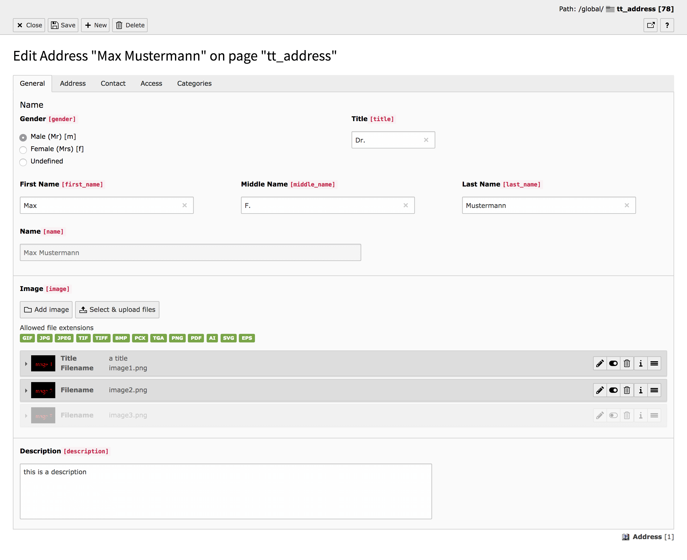
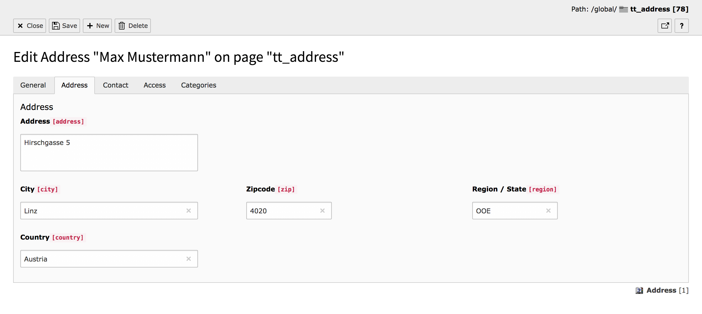
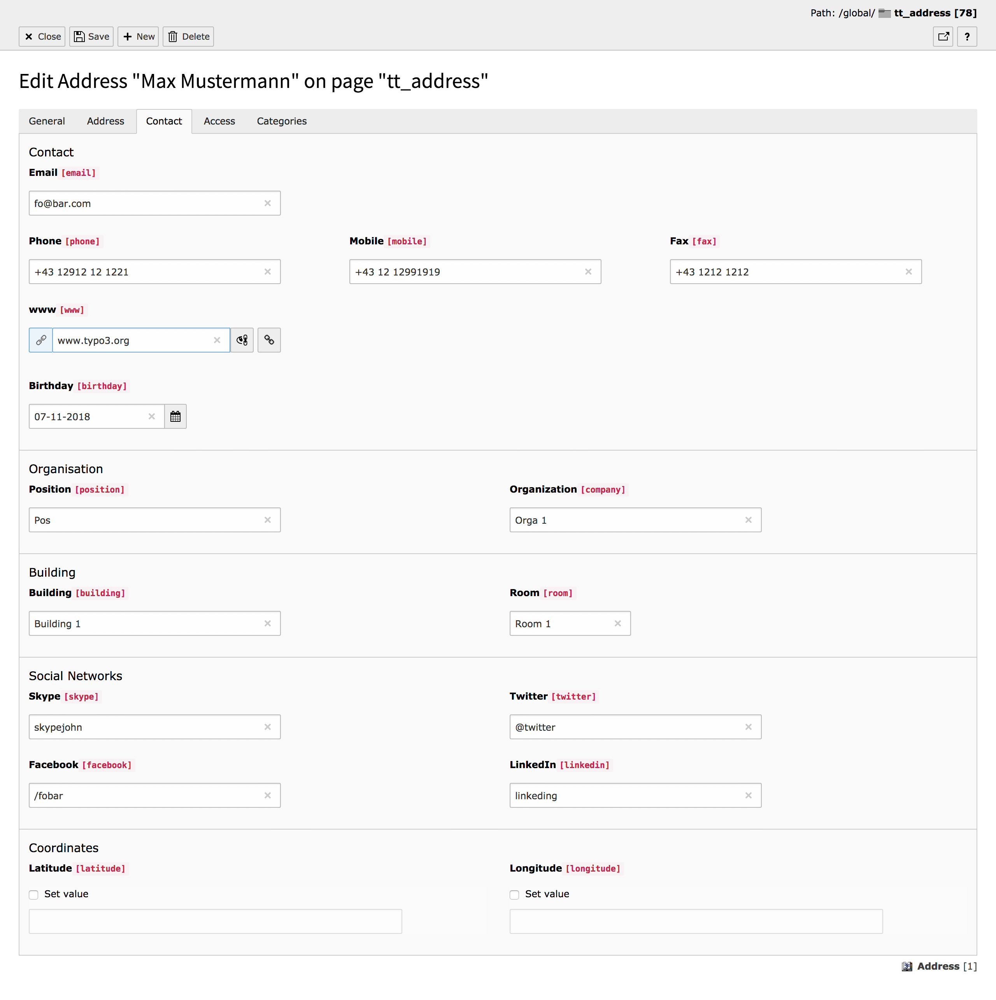

.. include:: /Includes.rst.txt

.. _introduction:

Introduction
============

What does it do?
----------------

This 2 goals of this extension are:

- Provide records which represent addresses and a plugin to output those in various variants
- Provide a solid base for other extensions which use and extend the records.

Benefits of this extension are:

- actively maintained
- is 100% covered by unit & functional tests
- supports in its current version TYPO3 8.7 LTS & 9.5 LTS
- implements all important micro data information to improve onpage search engine optimization (rich snippets)
- Default templates are based on Twitter Bootstrap

Screenshots
-----------

