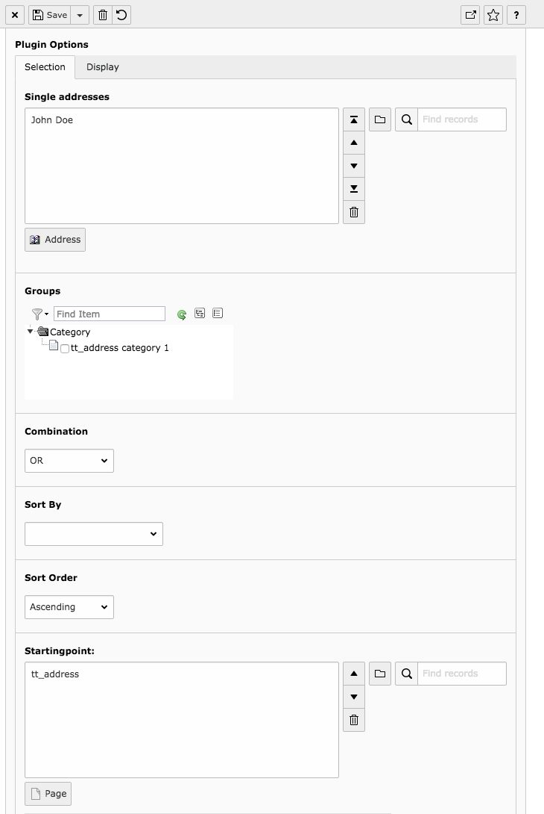

.. ==================================================
.. FOR YOUR INFORMATION
.. --------------------------------------------------
.. -*- coding: utf-8 -*- with BOM.

.. include:: ../Includes.txt

.. _introduction:

Introduction
============

What does it do?
----------------

The extension comes with a plugin where either single tt_address records can get selected or as an
alternative the selection can be made through groups. That group selection can have AND or OR
combinations of groups. Additionally the plugin offers to select a template to display the address
records.

In both, the tt_address records and the plugin the groups can be selected through a tree view.

The advantage of using address records through the plugin instead of inserting them with the
“Insert record” content element especially pays of with larger sites with a lot of address
records, so you can assign the groups to addresses and on a page you make a selection by groups,
thus if a person changes its function you don't need to search the whole site where that person is
shown. Instead you just assign his old group to a new person and it is exchanged through out the
whole site.

Screenshots
-----------

This is the plugin with the tree selector.

