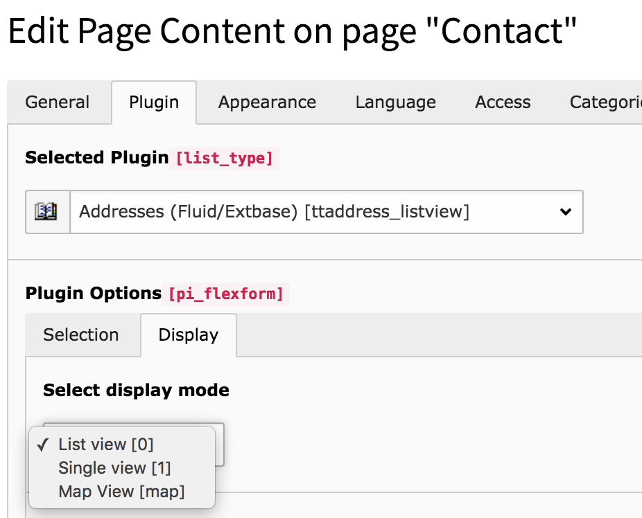

.. include:: /Includes.rst.txt

.. _tutorial-displaymode:

Create custom display mode
==========================
The setting **Display Mode** can be found in the tab "Display". It can be used to change the template depending
on the selection.

Add a new value
---------------
Add the following code to your `Page TsConfig`, either in the field *TsConfig* in the page properties or better to your site package extension.

.. code-block:: typoscript

    TCEFORM {
        tt_content {
            pi_flexform {
                ttaddress_listview {
                    sDISPLAY {
                        settings\.displayMode.addItems {
                            map = Map View
                        }
                    }
                }
            }
        }
    }

Now a new option **Map View** is available with the value `map`.

Adopt templates
---------------
If a displaymode is selected, this can be checked in the template with `{settings.displayMode}`.
