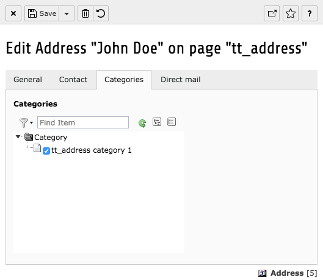

.. ==================================================
.. FOR YOUR INFORMATION
.. --------------------------------------------------
.. -*- coding: utf-8 -*- with BOM.

.. include:: ../../Includes.txt

.. _users-manual-assigning-groups-to-an-address:

Assigning groups to an address record
-------------------------------------

Adding groups to an address is as easy as adding a parent group to another group. Open the address
record you want to assign a group to or create a new address record, go to the category tab and
add one or more groups by checking the corresponding checkbox of the group. You can choose
multiple groups

|image-4|

