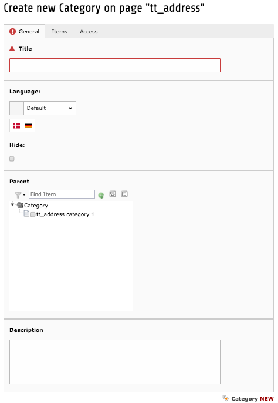

.. ==================================================
.. FOR YOUR INFORMATION
.. --------------------------------------------------
.. -*- coding: utf-8 -*- with BOM.

.. include:: ../../Includes.txt

.. _users-manual-creating-a-group:

Creating a Group
----------------

Since version 3.0, tt_address uses the system category to categorize the tt_address records.

Just select Category from the new record wizard in the list view.

|image-3|

