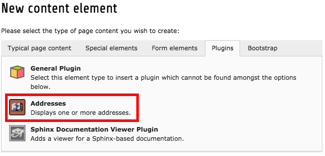
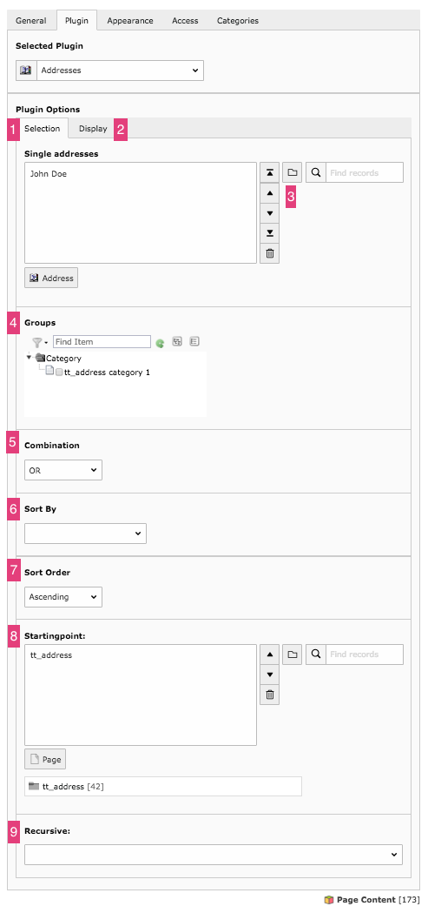

.. include:: /Includes.rst.txt

.. _users-manual-creating-a-plugin-content:

Creating a Plugin Content Element
---------------------------------

Go to the backend page module and navigate to the page where you want to insert 
one or more address plugins and also addresses. 
Create a new content and in the “new page content wizard” scroll down to the plugins section
and select "Addresses"

|image-2|

Now on the plugin tab and its plugin options first tab [1] ("Selection") you can add address records to the plugin. 
The second tab [2] ("Display") is for selecting a template for how the address should look like. 
This needs to be configured by your
administrator. If there are no dialog fields on the second tab, just save the content element once and
after saving it they should appear.

|image-7|

In the Single addresses field [3] you can select addresses by using the known element
browser. Even if the addresses selected here would be selected via groups, they do not appear
twice in the front end.

In the groups field [4] you can select groups from the tree view. These groups get combined either
by AND or by OR [5]. That means you can select addresses which are in all of the given groups (AND)
or they are required to be in at least one of the given groups (OR).

You set the sorting of the addresses by selecting the sort order dropdown [7].

The starting point [8] does not necessarily need to be set. The extension can be configured to work with
a default setting which needs to be adjusted by your administrator. If you set a starting point here,
it will override the default setting for it. The recursive field [9] sets how deep in
the page tree's subpages beginning from the starting point the system should look for addresses in the given
groups.
