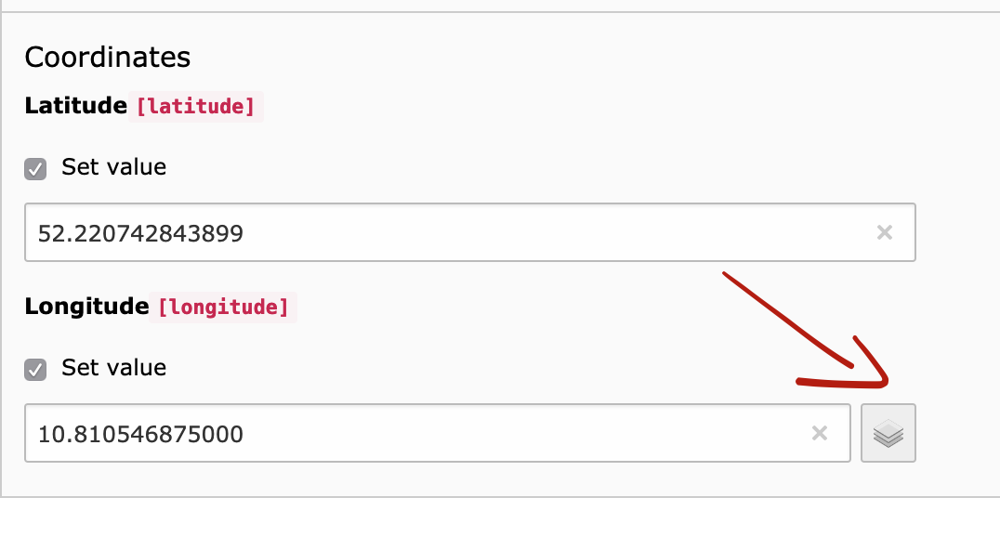

.. ==================================================
.. FOR YOUR INFORMATION
.. --------------------------------------------------
.. -*- coding: utf-8 -*- with BOM.

.. include:: ../../Includes.txt

.. _users-manual-maps:

Rendering records with a map
============================

Since version *4.2.0* the extension is capable of rendering records on a map.
The following variants are included by default:

- Leaflet
- Google Maps
- Static Google Maps

Providing coordinates in records
--------------------------------
If a record should be rendered on a map the record must contain coordinates in format of latitude and longitude.

The coordinates can either be provided manually or by using the wizard in the backend.

Frontend integration
--------------------
To output the records, 2 important configurations need to be set in the plugin.

**First**, the setting *Ignore records with no latitude/longitude* must be set.
Otherwise records with no coordinates would be rendered in the frontend

**Second**, the setting *Select display mode* in the 2nd tab *Display* must be changed to `map`.

Which map type is used is defined with TypoScript: :ts:`plugin.tx_ttaddress.map.rendering = googleMaps`.
Available options are: leaflet (default), googleMaps or staticGoogleMaps.

For each render type, a custom fluid section is available in the partial `Partials/Maps.html`.

